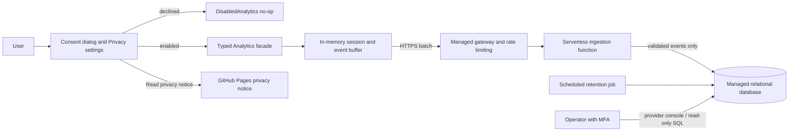
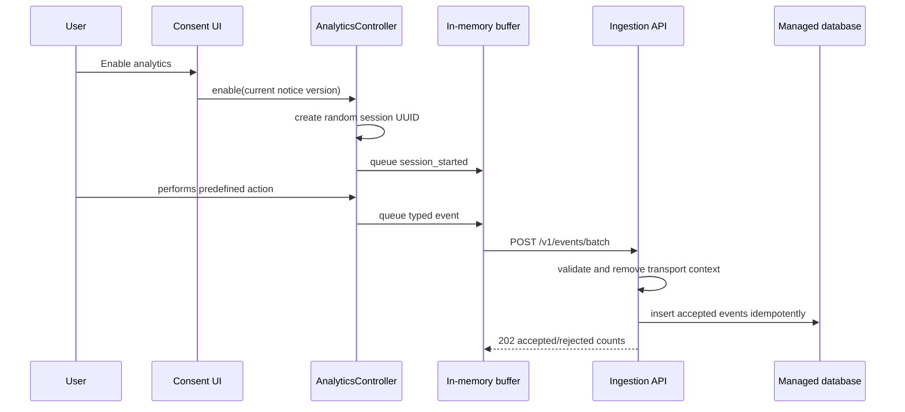
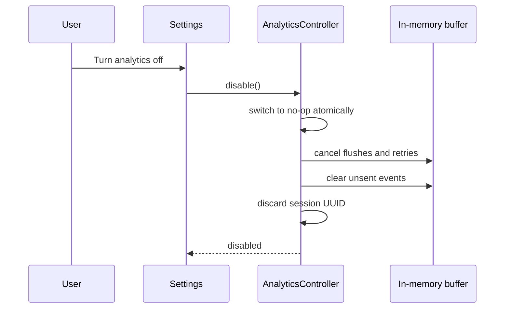
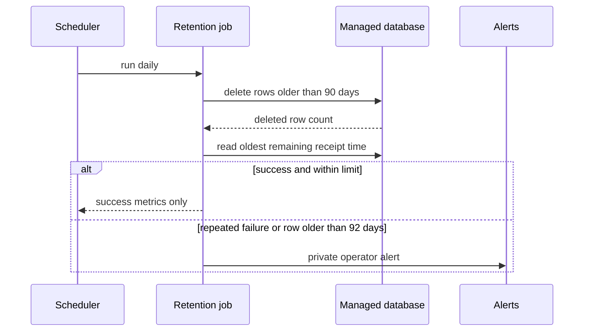

# Privacy-Preserving Product Analytics Design

**Status:** Approved design

**Date:** 2026-08-29

**Application:** Tennis Record desktop application

**Privacy contact:** `leetvin@gmail.com`

## 1. Purpose

Tennis Record needs enough product analytics to answer questions such as:

- Which major actions and features are used?
- How long does an application session last?
- How often do exports start, complete, fail, or get cancelled?
- How long do important operations take?
- Which application versions and broad operating-system families are active?

The solution must be usable by a solo developer, inexpensive to operate, and deliberately resistant to accidental collection of video, project, player, or device information. It must support users in the EU/EEA, United States, and Canada without creating a user profile or a persistent installation identity.

This document specifies the user experience, desktop components, event contract, transport, managed backend, database, retention, privacy notice, operational controls, testing, and rollout. The final infrastructure provider is intentionally selected in a separate decision.

## 2. Goals and non-goals

### 2.1 Goals

- Obtain an explicit, optional analytics choice.
- Keep all application functionality available when analytics is declined.
- Use a new random identifier whenever analytics starts in an application launch.
- Measure process-session duration and a strict set of product actions.
- Collect sanitized outcome and performance information.
- Send events asynchronously through a versioned HTTPS contract.
- Put validation and data minimization ahead of storage.
- Store accepted events in an inexpensive managed relational database.
- Delete raw events automatically after 90 days.
- Publish a stable, plain-language privacy notice on GitHub Pages.
- Keep the design portable across managed infrastructure providers.
- Make failures invisible to normal editing and exporting workflows.

### 2.2 Non-goals for version one

- Persistent installation, device, account, or user identifiers
- Recognition of a person or installation across application launches
- Retention, cohort, or daily/weekly/monthly-returning-user analysis
- Geographic or IP-based product analytics
- Active-editing-time or attention tracking
- Crash reports, stack traces, log uploads, or free-form diagnostics
- Filenames, paths, project identifiers, player data, scores, or video content
- Advertising, attribution, cross-application tracking, or data sale
- A/B testing, remote feature control, or behavioral personalization
- Third-party analytics SDKs
- A custom analytics dashboard
- Provider selection or provider-specific infrastructure code

## 3. Governing design principles

1. **No event before consent.** An undecided or disabled preference always resolves to a no-op analytics implementation.
2. **No persistent subject identity.** A session UUID exists only in memory and is discarded when analytics stops or the process exits.
3. **Typed events only.** Application code cannot submit arbitrary names, maps, strings, or JSON.
4. **Allowlist at both ends.** The desktop serializer and ingestion function independently enforce the event registry.
5. **Transport metadata is not analytics data.** IP addresses and request headers may be processed transiently to deliver and protect the endpoint, but are not inserted into the analytics database or application logs.
6. **Best effort only.** Analytics never blocks, slows, or changes product behavior.
7. **Short raw retention.** Raw session-linked events expire after 90 days, including through the backup lifecycle.
8. **Honest terminology.** Raw data is called optional or privacy-preserving usage analytics, not anonymous analytics.
9. **No secret in the client.** A public desktop binary cannot safely hold an ingestion credential.
10. **Directional product evidence.** Because a public endpoint can be imitated, analytics is suitable for product decisions, not security, billing, or audited financial claims.

## 4. Approved architecture

The approved approach is a managed HTTPS ingestion function in front of a managed PostgreSQL-compatible database. The privacy notice is hosted separately on GitHub Pages.



The stable boundary is `POST /v1/events/batch`. Provider-specific services may change without changing the desktop application as long as they implement this contract.

### 4.1 Provider selection requirements

The later provider decision must select services that support:

- A low-cost or free managed HTTPS function or equivalent compute
- A low-cost managed PostgreSQL-compatible database
- TLS for all external and database connections
- Private database connectivity or an equivalent network restriction
- A documented data-processing agreement and subprocessor list
- A selectable and documentable processing region
- Configurable request, access, function, and database logs
- MFA and least-privilege administration
- Automated database backups with configurable retention
- A scheduler for daily deletion jobs
- Database export and complete deletion without vendor lock-in
- Usage and budget alerts

Analytics must remain compiled off in production until this selection is recorded and the privacy notice names the deployed provider, region, material subprocessors, and infrastructure log retention.

## 5. User experience and consent

### 5.1 Consent states

Local application preferences contain:

```text
analyticsChoice = UNDECIDED | ENABLED | DISABLED
analyticsNoticeVersion = positive integer
analyticsChoiceRecordedAt = local ISO-8601 timestamp
```

The timestamp remains on the device and is never transmitted. The application defines `CURRENT_ANALYTICS_NOTICE_VERSION` at build time.

Effective state is determined as follows:

| Stored state | Stored version | Effective behavior |
|---|---:|---|
| Missing or `UNDECIDED` | Any | Disabled; present the one-time choice |
| `ENABLED` | Current | Enabled |
| `DISABLED` | Current | Disabled |
| Either decided state | Older than current | Disabled; present the revised choice once |
| Any state | Newer than current | Disabled as a fail-safe |

A decision made for the current notice version is not requested again. Closing or dismissing the consent UI records `DISABLED` for the current notice version.

### 5.2 First-launch consent UI

After the main window is usable, the application shows a non-coercive, modeless dialog or sheet. It must not prevent the user from beginning work. Until the user chooses, analytics remains disabled.

Approved copy:

> **Help improve Tennis Record**
>
> Send optional usage statistics such as features used, session duration, operation timings, app version, operating-system family, and whether operations succeeded. Tennis Record does not send video content, filenames, file paths, player information, project data, or a persistent device identifier.

Actions:

- `Enable analytics`
- `No thanks`
- `Read privacy notice`

`Enable analytics` and `No thanks` have comparable visual prominence. There is no countdown, repeated prompt, disabled product feature, preselected checkbox, or acceptance inferred from continued use.

`Read privacy notice` opens the configured GitHub Pages URL in the system browser. A browser-opening failure shows a copyable URL and does not enable analytics.

### 5.3 Settings UI

The existing Settings experience gains a **Privacy** section containing:

- A `Send optional usage analytics` toggle
- A compact list of collected data
- A compact list of specifically excluded data
- `View privacy notice`
- `Email privacy contact`, linked to `mailto:leetvin@gmail.com`

Enabling analytics in Settings:

1. Records `ENABLED` and the current notice version locally.
2. Creates a new in-memory analytics session.
3. Emits `session_started` as the first event.
4. Begins batching only subsequent activity.

No activity that occurred before enabling is reconstructed or sent.

Disabling analytics:

1. Atomically changes the effective implementation to `DisabledAnalytics`.
2. Cancels scheduled flushes and retries.
3. Clears all unsent events in memory.
4. Discards the in-memory session UUID.
5. Records `DISABLED` for the current notice version locally.

The disable path does not wait for or send a final event. Previously accepted events age out under the 90-day retention policy. Because earlier session identifiers are deliberately not retained on the device or associated with an email address, the operator normally cannot locate historical sessions after they end.

### 5.4 Material notice changes

The consent version increments before releasing any of these changes:

- New event categories or materially broader properties
- A persistent or cross-session identifier
- Longer raw-event retention
- A new analytics purpose
- Advertising, attribution, sale, or sharing with another controller
- Collection of location, user content, or sensitive information

An editorial correction, contact-detail correction, or clearer explanation of unchanged processing does not require a consent-version increment. Every published edit still receives an effective date in the page history.

## 6. Desktop component design

The new code belongs under `src/main/kotlin/org/litvin/analytics/`, with UI-specific consent components under `src/main/kotlin/org/litvin/ui/privacy/`. Analytics must not be added to project manifests, EDL files, score files, or export output.

### 6.1 Public boundary

Feature code receives only this conceptual interface:

```kotlin
interface Analytics {
    fun record(event: AnalyticsEvent)
}
```

`record` returns immediately and never throws into its caller. The implementation is one of:

- `DisabledAnalytics`: drops calls without allocation or I/O
- `EnabledAnalytics`: enriches typed events with session metadata and queues them

Application composition chooses the implementation from the effective consent state. Feature code must not read the consent preference directly.

### 6.2 Components and responsibilities

| Component | Responsibility | Must not do |
|---|---|---|
| `AnalyticsPreferences` | Read and write local consent state and notice version | Send network requests |
| `AnalyticsController` | Switch atomically between enabled and disabled modes | Define feature events |
| `AnalyticsSession` | Own the in-memory UUID, sequence counter, monotonic start time, and lifecycle | Persist identifiers |
| `AnalyticsEventRegistry` | Define event names, typed properties, limits, and schema mapping | Accept free-form values |
| `AnalyticsBuffer` | Hold a bounded queue and create batches | Write events to disk |
| `AnalyticsTransport` | Send HTTPS requests and classify responses | Know product semantics |
| `AnalyticsLifecycle` | Emit start, heartbeat, and normal-end events | Delay shutdown materially |
| `AnalyticsClock` | Supply monotonic elapsed time for testability | Use local wall time in events |

### 6.3 Session semantics

An analytics session starts when enabled analytics begins during an application process. This may be at application startup or later through Settings. Its UUID is generated with a cryptographically strong UUID v4 implementation and remains only in memory.

Session duration means elapsed process time while analytics was enabled. It does not claim to represent active editing time. The top-level `elapsed_ms` uses a monotonic clock and is clamped to the range `0..604800000` (seven days).

Lifecycle events are:

- `session_started` immediately after session construction
- `session_heartbeat` every five minutes while enabled
- `session_ended` during normal shutdown, using a short best-effort flush

If the application crashes or loses connectivity, the maximum received `elapsed_ms` estimates session duration. Heartbeats bound ordinary undercounting to approximately five minutes. A session with only `session_started` has a measured duration of zero and is marked incomplete in query views.

### 6.4 Sequence and idempotency

Each session starts at sequence number `0`. Every queued event receives the next non-negative integer. `(session_id, sequence_number)` is unique. Retrying the same batch does not allocate new sequence numbers.

Sequence gaps are allowed because a bounded buffer may discard events. Server queries must not interpret a gap as a product failure.

### 6.5 Memory buffer and batching

- Maximum events in memory: `100`
- Normal flush interval: `30 seconds`
- Immediate flush threshold: `20 events`
- Maximum events in a request: `20`
- Maximum serialized request: `64 KiB`
- Persistence: none

When full, the buffer discards the oldest non-lifecycle event. Lifecycle events may replace an older heartbeat, but the first `session_started` event is retained while the session remains buffered. A drop counter may be written to a local diagnostic log as a number only; it is not sent as an analytics property.

No executor used for analytics may keep the JVM alive during shutdown.

### 6.6 Retry behavior

| Condition | Behavior |
|---|---|
| DNS, connection, timeout, or TLS failure | Retry in memory with capped exponential backoff and jitter |
| HTTP `429` | Respect a bounded `Retry-After` when present, otherwise back off |
| HTTP `500..599` | Retry in memory |
| HTTP `400`, `404`, `409`, `413`, `415`, or `422` | Drop the affected batch; do not retry |
| HTTP `410` | Cancel delivery for the rest of the process session and clear the queue |
| Any unrecognized `4xx` | Drop the batch; do not retry |

Backoff begins at approximately one second, doubles to a maximum of five minutes, adds jitter, and ends when the process exits or consent is disabled. Analytics transport uses short connection and response timeouts. A normal shutdown may attempt one flush with a total budget no greater than 500 ms; it then abandons the queue.

### 6.7 Local diagnostics

Local logs may contain:

- Transport state such as `analytics batch rejected: unsupported_schema`
- HTTP status class
- Accepted and rejected event counts
- Retry count and coarse latency
- Buffer size and dropped-event count

Local logs must not contain request bodies, event properties, session UUIDs, IP addresses, URLs with query parameters, database errors with values, or response bodies.

## 7. Event contract

### 7.1 Batch envelope

Conceptual JSON request:

```json
{
  "schema_version": 1,
  "notice_version": 1,
  "session_id": "7df3a8ca-4d5d-44d1-913d-ae553df3916f",
  "app_version": "1.0.0",
  "os_family": "windows",
  "events": [
    {
      "sequence_number": 0,
      "name": "session_started",
      "elapsed_ms": 0,
      "properties": {}
    }
  ]
}
```

The envelope deliberately omits client wall-clock time, time zone, locale, IP address, machine name, user name, device model, hardware serial, project ID, and installation ID.

### 7.2 Global validation

| Field | Rule |
|---|---|
| `schema_version` | Supported positive integer; initially `1` |
| `notice_version` | Positive integer recognized by the deployment |
| `session_id` | Canonical UUID v4 string |
| `app_version` | Release version matching `[0-9A-Za-z.+-]{1,32}` |
| `os_family` | `windows`, `macos`, `linux`, or `other` |
| `events` | Array of 1 to 20 items |
| `sequence_number` | Integer `0..1000000` |
| `name` | Exact registry value, maximum 64 characters |
| `elapsed_ms` | Integer `0..604800000` |
| `properties` | Exact event-specific object, maximum 2 KiB serialized |

Unexpected envelope fields, unexpected event fields, unknown properties, wrong types, out-of-range values, and non-finite numbers are rejected. Strings are forbidden except where the registry defines a closed enum. There is no generic `label`, `message`, `path`, `name`, `description`, or `metadata` property.

### 7.3 Initial event registry

The registry is intentionally small. Names describe completed user-meaningful actions rather than low-level clicks.

| Event | Allowed properties | Meaning |
|---|---|---|
| `session_started` | None | Enabled analytics session began |
| `session_heartbeat` | None | Five-minute lifecycle checkpoint |
| `session_ended` | None | Normal application shutdown |
| `project_created` | None | A local project was created |
| `project_opened` | None | A local project was opened |
| `source_video_opened` | `result` | A video-open operation completed |
| `markup_point_added` | None | A markup point was added |
| `markup_point_removed` | None | A markup point was removed |
| `score_point_recorded` | None | A score point was recorded |
| `adjustment_changed` | `adjustment_category` | A supported adjustment category changed |
| `export_started` | `container`, `encoder_family` | An export process was requested and started |
| `export_completed` | `container`, `encoder_family`, `duration_ms` | Export completed successfully |
| `export_failed` | `failure_category`, `duration_ms` | Export ended in a sanitized failure category |
| `export_cancelled` | `duration_ms` | User cancelled an export |

Allowed enums:

```text
result = success | unsupported | invalid_media | unavailable | other
adjustment_category = crop_rotate | color | scale | other
container = mp4 | mov | mkv | other
encoder_family = software | nvidia | intel | amd | apple | other
failure_category = validation | dependency_unavailable | encoder_unavailable |
                   process_start | processing | output_write | other
```

`duration_ms` is an integer in `0..604800000` and measures only the export attempt represented by the outcome event. Cancellation is not recorded as failure. Detailed codec flags, resolution, frame rate, source duration, output size, filesystem information, FFmpeg text, exception type, and exception message are excluded from version one.

### 7.4 Adding or changing an event

Every registry change requires a review containing:

1. The product question the event answers
2. Why existing events cannot answer it
3. Exact allowed properties and cardinality
4. Confirmation that no value comes from user-authored text, filesystem paths, media metadata, or exception text
5. Retention and notice impact
6. Whether the consent version must change
7. Client, server, SQL, and privacy-copy tests

Removing an event does not require renewed consent. Broadening a property or purpose normally does.

## 8. Ingestion API

### 8.1 Endpoint

```http
POST /v1/events/batch
Content-Type: application/json
```

No cookie, authorization token, client secret, or stable client credential is used. The server must not enable credentialed browser CORS. Omitting CORS is a minor browser-abuse reduction, not an authentication control.

### 8.2 Request processing order

1. Gateway enforces TLS, supported method, content type, body size, and coarse rate limits.
2. Infrastructure processes source IP transiently for routing and abuse prevention.
3. Function parses JSON with bounded depth and collection sizes.
4. Function validates the envelope.
5. Function validates every event against the selected registry version.
6. Function overwrites all server-owned fields, including receipt time.
7. Function inserts accepted events in one bounded transaction with conflict-ignore idempotency.
8. Function returns counts and stable reason codes.

The function never forwards the source IP or request headers to the database layer.

### 8.3 Success response

```http
HTTP/1.1 202 Accepted
Content-Type: application/json

{
  "accepted": 20,
  "rejected": 0,
  "reasons": []
}
```

For a partially valid batch, valid events may be accepted and invalid events rejected. `reasons` contains only bounded codes and counts, never echoed values:

```json
{
  "accepted": 18,
  "rejected": 2,
  "reasons": [
    { "code": "unknown_event", "count": 2 }
  ]
}
```

### 8.4 Status semantics

| Status | Meaning |
|---:|---|
| `202` | Request processed; see counts |
| `400` | Malformed JSON or envelope |
| `404` | Unknown API route |
| `410` | Analytics ingestion administratively disabled |
| `413` | Body or batch too large |
| `415` | Unsupported content type |
| `422` | No valid event could be accepted |
| `429` | Rate limit exceeded |
| `500` | Unexpected function failure |
| `503` | Database or required dependency unavailable |

Responses contain no stack traces, framework diagnostics, database messages, or submitted values.

### 8.5 Abuse controls

The endpoint is public by necessity. Controls include:

- Per-source transient edge rate limits
- Global request and spend limits
- Maximum body, batch, depth, and property sizes
- Strict enums and numeric ranges
- Database uniqueness constraints
- Short execution timeouts and bounded connection pools
- Alerts for rejection rate, request volume, error rate, and spend
- An emergency `410` kill switch
- Optional provider bot/abuse controls that do not add analytics identifiers

The data is treated as approximate. Product decisions should prefer sustained trends and should not trust isolated spikes without corroboration.

## 9. Database design

### 9.1 Runtime role separation

- `analytics_ingest`: insert into the raw event table and read only what is required to resolve conflicts
- `analytics_reader`: read approved views; no raw-table mutation
- `analytics_migrator`: schema migration and retention-function privileges; never used by the runtime
- Provider administrator: break-glass access protected by MFA

The function uses credentials from the managed secret store. Credentials are never committed, logged, returned to the desktop, or reused for administration.

### 9.2 Raw table

Provider-neutral PostgreSQL DDL:

```sql
CREATE TABLE analytics_event (
    session_id UUID NOT NULL,
    sequence_number INTEGER NOT NULL,
    received_at TIMESTAMPTZ NOT NULL DEFAULT CURRENT_TIMESTAMP,
    schema_version SMALLINT NOT NULL,
    notice_version SMALLINT NOT NULL,
    event_name VARCHAR(64) NOT NULL,
    elapsed_ms BIGINT NOT NULL,
    app_version VARCHAR(32) NOT NULL,
    os_family VARCHAR(16) NOT NULL,
    properties JSONB NOT NULL DEFAULT '{}'::jsonb,
    PRIMARY KEY (session_id, sequence_number),
    CHECK (sequence_number BETWEEN 0 AND 1000000),
    CHECK (elapsed_ms BETWEEN 0 AND 604800000),
    CHECK (octet_length(properties::text) <= 2048)
);

CREATE INDEX analytics_event_received_at_idx
    ON analytics_event (received_at);

CREATE INDEX analytics_event_name_received_at_idx
    ON analytics_event (event_name, received_at);
```

The ingestion function is the authoritative semantic validator. Database checks are a second boundary, not a replacement for the registry.

No generated database ID is required. The composite primary key provides idempotency and avoids another event identifier.

### 9.3 Query views

`analytics_session_summary` groups by session UUID and exposes:

- First and last receipt time
- Maximum elapsed milliseconds as measured session duration
- Whether `session_ended` was received
- App version and OS family
- Total accepted event count
- Export starts, completions, failures, and cancellations

`analytics_daily_event_count` groups by UTC receipt date, event name, app major/minor version, and OS family.

`analytics_daily_export_outcome` groups export outcomes by UTC date and app major/minor version and exposes bounded export-duration distributions.

`analytics_export_duration` exposes validated `duration_ms` values from export outcome events for percentile queries. It excludes starts, synthetic smoke events, and any row whose validated property is absent.

Example questions and sources:

| Question | Source |
|---|---|
| How many measured sessions occurred per day? | `analytics_session_summary` grouped by first receipt date |
| What is median measured session length? | Maximum `elapsed_ms` per session |
| Which features are used? | Daily event counts |
| What fraction of exports complete? | Export outcome view, with starts as denominator |
| Which failures dominate? | `failure_category` in `export_failed` |
| How long do successful and failed exports take? | `analytics_export_duration` percentiles grouped by outcome and app version |
| Which releases remain active? | Session summary grouped by app version |

Queries must disclose that incomplete sessions may be underestimated and that opted-out users are absent.

### 9.4 Retention

A scheduled job runs at least daily:

```sql
DELETE FROM analytics_event
WHERE received_at < CURRENT_TIMESTAMP - INTERVAL '90 days';
```

The job records only deletion count, completion status, and duration. An alert fires if it fails on two consecutive runs or if the oldest event exceeds 92 days.

Managed backups use a rolling window no longer than 30 days unless a shorter provider minimum is available. A deleted raw event may remain in an encrypted rolling backup until that backup expires, but is not restored except for disaster recovery. A restore procedure must immediately re-run retention before enabling queries or ingestion.

### 9.5 Aggregates

Version one does not require indefinite aggregate storage. Ninety-day raw views are sufficient for the initial product questions and avoid premature complexity.

If longer trend retention is added later, the aggregate table must contain no session UUID and must suppress or merge any daily dimension group representing fewer than 20 distinct sessions. This change requires a documented anonymity review before deployment.

## 10. Infrastructure privacy and security

### 10.1 Logging configuration

Default managed-service logs often include information excluded by this design. Deployment must explicitly inspect and configure:

- Gateway/access logs
- CDN or edge-security logs
- Function invocation logs
- Function error reporting
- Database query and connection logs
- Backup audit logs
- Provider support diagnostics

Application-controlled logs contain only request outcome, coarse latency, accepted/rejected counts, bounded rejection codes, and generated infrastructure correlation IDs that are not stored with analytics events.

If the provider cannot disable infrastructure IP logs, the selected configuration must use the shortest practical security retention, prohibit their use for product analytics, prevent joining them to the event table, and disclose the retention on the privacy page.

### 10.2 Network and data security

- TLS is required from desktop to gateway and function to database.
- Database public access is disabled when the provider supports private connectivity.
- Runtime credentials have insert-only least privilege.
- Administrator and provider accounts require MFA.
- Production access is limited to the operator and audited by the provider.
- Secrets are rotated after suspected exposure and on provider migration.
- Database and backups use provider-managed encryption at rest.
- Development and staging use separate databases and credentials.
- Production events are not copied to local development machines.
- Test fixtures contain synthetic UUIDs and synthetic events only.

### 10.3 Operational alerts

Provider-native alerts cover:

- Elevated `5xx` and database failure rates
- Sustained `4xx` rejection increases
- Rate-limit activation and request-volume anomalies
- Retention-job failure and oldest-row age
- Database capacity and connection exhaustion
- Function or database spend thresholds
- Backup failure
- Administrator login or privilege changes when supported

Alerts go to a private operator channel, not a public issue tracker.

## 11. GitHub Pages privacy notice

### 11.1 Repository and URL

Implementation adds `docs/privacy/analytics.md` with a stable GitHub Pages permalink ending in `/privacy/analytics/`. The published absolute URL is supplied to the desktop release as `ANALYTICS_PRIVACY_URL`.

The page contains no project analytics, advertising, third-party JavaScript, embedded trackers, externally hosted fonts, or unnecessary cookies. GitHub Pages remains a website hosting provider and is named as such where required.

A release gate verifies:

- The absolute URL uses HTTPS and returns success.
- The page version equals `CURRENT_ANALYTICS_NOTICE_VERSION`.
- `leetvin@gmail.com` is present and linked.
- The deployed backend provider, database region, material subprocessors, and infrastructure log retention are filled with the actual selected values.
- The page contains all mandatory sections below.

Analytics remains compiled off if this gate fails. These are deployment inputs, not values the application may guess.

### 11.2 Required notice content

The production notice uses the following structure and claims.

#### Optional usage analytics

Tennis Record is operated by its developer. Privacy questions may be sent to `leetvin@gmail.com`.

Tennis Record can send optional usage analytics to help understand which features are useful, how long application sessions last, how long exports take, and whether major operations succeed. Analytics is disabled until the user chooses to enable it. Declining does not change application functionality, and the choice can be changed in Settings at any time.

#### Data collected when enabled

- A new random session identifier generated whenever analytics starts in an application launch
- A predefined name for a major product action
- Time elapsed since that analytics session began
- Application version
- Broad operating-system family: Windows, macOS, Linux, or other
- Predefined operation results, error categories, and bounded operation durations
- Event schema and privacy-notice versions
- Server receipt time

#### Data not collected

Tennis Record analytics does not collect video or audio content, filenames, filesystem paths, project names or identifiers, player information, scores, account information, email addresses, exact location, advertising identifiers, hardware serial numbers, persistent installation identifiers, stack traces, exception messages, or free-form text.

#### Network and infrastructure data

The hosting infrastructure necessarily processes an IP address and ordinary network headers to deliver and protect the HTTPS endpoint. Tennis Record does not insert this information into its analytics database or use it for product analytics. The notice names the selected providers and states the configured infrastructure-security log retention.

#### Purpose and choice

The sole purpose is first-party product improvement and reliability measurement. For EU/EEA processing, the chosen basis is the user’s consent. Canadian users receive the same express choice. The data is not sold, used for advertising, or shared with another business for its independent purposes.

#### Retention

Raw events, including the random session identifier, are deleted after 90 days. Encrypted rolling backups expire within the separately stated backup window, no longer than 30 additional days. Version one does not retain analytics aggregates indefinitely.

#### Withdrawal

Turning off `Send optional usage analytics` in Settings immediately stops new collection and deletes unsent events from memory. Historical session identifiers are not stored on the device or connected to an email address, so the operator normally cannot identify which historical rows came from a particular person. Users are not asked to provide additional personal information solely to identify those rows. They expire automatically under the retention policy.

#### Access and questions

Users may contact `leetvin@gmail.com` with privacy questions or requests. The operator explains whether a request can be fulfilled with the information available and does not direct the user to a public GitHub issue.

#### Security and recipients

The notice identifies the managed ingestion, database, and GitHub Pages providers, their roles, processing regions, and links to their relevant privacy information. It summarizes TLS, restricted database access, short retention, and administrative MFA without exposing credentials or defensive configuration.

#### Changes

The page displays its effective date, integer notice version, and change history. A materially broader collection or purpose disables analytics until the user makes a new choice in the application.

### 11.3 Privacy request handling

Privacy emails are handled privately. The operator:

1. Records the request date and requested action in a private operational record.
2. Avoids requesting identity documents or unrelated personal data.
3. Determines whether the request can be connected to any stored event without creating a new identification system.
4. Explains limitations caused by deliberate session-ID disposal.
5. Completes actions that are technically possible and records the response date.
6. Deletes the private request record when it is no longer needed for accountability or dispute handling.

There is no public deletion endpoint in version one. A session UUID is not an authentication mechanism, and the application does not retain historical UUIDs merely to make rows more identifiable.

## 12. Data flow

### 12.1 Enable and record



### 12.2 Disable



### 12.3 Retention



## 13. Failure behavior

| Failure | User-visible impact | Data behavior |
|---|---|---|
| Privacy page cannot open | Copyable URL is shown | Analytics remains in its prior state |
| No network | None | Events retry only in memory and disappear at process exit |
| Endpoint rate limited | None | Bounded in-memory retry |
| Invalid client event | None | Event or batch is dropped; reason code logged without values |
| Database unavailable | None | Server returns retryable status; client backoff applies |
| Buffer full | None | Oldest non-lifecycle event is dropped |
| Normal shutdown | None | One flush with at most 500 ms budget |
| Crash or forced termination | None beyond the crash itself | Unsent events are lost; last heartbeat bounds duration estimate |
| Analytics kill switch active | None | Client clears queue and stops for current process session |
| Retention job fails | None | Private alert after two consecutive failures |
| Notice version mismatch | Consent choice UI may reappear | Analytics stays disabled until a new decision |

Analytics errors must never show a generic error dialog, prevent saving, alter export results, or trigger application failure handling.

## 14. Testing strategy

### 14.1 Desktop unit tests

- Every consent-state and notice-version transition
- Dismissal records disabled state
- No network object is created before effective consent
- Enabling mid-process starts a new session at elapsed zero
- Disabling swaps to no-op, cancels retries, clears the buffer, and discards identity
- Every registered event serializes to its exact schema
- Unknown properties and free-form strings cannot compile through the typed API
- Runtime defensive validation rejects paths, oversized fields, unknown enums, and non-finite numbers
- Sequence numbers remain stable across retries
- Queue limits and lifecycle-event preservation
- Thirty-second and twenty-event flush rules with a fake clock
- Retry classification, backoff cap, and `410` shutdown
- Heartbeat scheduling and best-effort end event
- `record` never throws into feature code
- Analytics executor does not hold process shutdown open

### 14.2 Desktop integration tests

- First launch with `UNDECIDED`
- `No thanks`, restart, and no repeat prompt for the same version
- Enable, perform representative actions, and inspect a fake HTTPS server request
- Disable with queued and in-flight events
- Material notice-version increment and re-consent
- Offline application use without disk artifacts
- Privacy link success and browser-open failure fallback

### 14.3 Shared contract tests

A provider-neutral JSON fixture suite is consumed by desktop serialization tests and backend validation tests. It includes:

- One valid fixture for every event type
- Boundary sizes and numeric limits
- Unknown envelope and event fields
- Unknown event and enum values
- Filenames, Windows and Unix paths, email-like strings, and exception-like text in forbidden locations
- Oversized, deeply nested, empty, and malformed bodies
- Duplicate event sequences
- Mixed valid and invalid batches

The contract fixture is versioned with the API schema.

### 14.4 Backend tests

- Method, TLS/gateway, content-type, and size enforcement
- Exact schema and registry validation
- Partial acceptance and bounded reason responses
- Idempotent duplicate insertion
- Runtime database-role restrictions
- No transport metadata reaches insert parameters
- No submitted values appear in logs or responses
- Connection-pool exhaustion and database outage behavior
- Rate limiting and emergency `410` switch
- Migration forward path on a clean and populated test database
- Daily retention and oldest-row alert conditions
- Restored-backup retention before reopening access

### 14.5 Query tests

Synthetic fixtures verify:

- Complete and incomplete session duration
- Heartbeat-based duration estimates
- Event counts and version grouping
- Export start/completion/failure/cancellation denominators
- Export-duration distributions and percentiles
- Duplicate retries do not inflate counts
- UTC day boundaries use server receipt time
- Synthetic production smoke events are excluded

### 14.6 Privacy page tests

- HTTPS URL is reachable
- Notice version matches the application constant
- Contact email is correct
- Required headings and exact exclusions are present
- Selected providers, region, subprocessors, and log retention are concrete
- No external scripts, trackers, forms, or externally hosted fonts are introduced
- All provider and privacy links resolve

### 14.7 Security and operational tests

- Dependency and secret scanning
- Database privilege test for each role
- Request-size and bounded-load tests within provider limits
- Spend-alert exercise in staging
- Retention-failure alert exercise
- Backup restoration followed by mandatory retention
- Operator-access and MFA review before production

## 15. Deployment and rollout

### 15.1 Environments

- **Local:** `DisabledAnalytics` by default; fake endpoint only in explicit developer tests
- **Staging:** synthetic events, separate function/database/secrets, no production data
- **Production:** real endpoint and notice, analytics feature gate initially off

Builds receive the endpoint and privacy URL through release configuration. Neither value is stored in project files. The endpoint is not sensitive; database and administrative credentials are.

### 15.2 Release gates

Before analytics can be enabled in a production build, all of the following must pass:

- Managed provider decision recorded
- Provider data-processing terms reviewed and retained
- Processing region and material subprocessors recorded
- Gateway, function, database, scheduler, and backups deployed
- Infrastructure logs inspected and configured
- Runtime and administrative permissions verified
- Retention job and alert tested
- Budget alerts configured
- Privacy notice published with concrete provider information
- Notice URL/version release check passed
- Contract, integration, migration, and privacy-page tests passed
- Emergency `410` switch tested
- Production smoke event accepted and excluded from product views

### 15.3 Rollout stages

1. Deploy backend with ingestion administratively disabled.
2. Exercise staging end to end with synthetic data.
3. Deploy production schema, retention, alerts, and privacy page.
4. Enable production ingestion for a dedicated smoke client.
5. Release a small pre-release desktop build with the consent UI enabled.
6. Verify consent, ingestion, query correctness, log content, rate, and cost.
7. Enable the consent UI in the general release.
8. Review the first week for unexpected fields, logs, failures, and spend.

The current and immediately preceding event-schema versions are supported concurrently. Removing an old schema requires evidence that the corresponding desktop release is no longer materially active or an explicit decision to accept event loss from that release.

## 16. Observability without event exposure

Backend operational metrics include:

- Requests and events accepted/rejected
- Response status distribution
- Stable rejection-code counts
- Function and database latency
- Retryable dependency failures
- Rate-limit activations
- Retention deletion count and oldest row age
- Database storage and connection utilization
- Estimated and actual provider spend

Metrics do not use session UUID, app version, OS family, event properties, request headers, or IP as observability labels. Product analytics remains in approved SQL views, not operational logging.

## 17. Documentation deliverables for implementation

Implementation must produce and keep synchronized:

- Desktop event registry and generated/handwritten schema documentation
- Versioned request/response examples
- Shared valid and invalid contract fixtures
- Database migrations and view definitions
- Provider deployment record and data-flow inventory
- Retention and backup-restore runbook
- Incident and credential-rotation runbook
- Privacy request handling checklist
- GitHub Pages analytics privacy notice and change history
- Release checklist proving endpoint and notice versions match
- A short operator query guide for the approved SQL views

## 18. Acceptance criteria

The solution is ready for general release only when:

1. A clean installation sends no analytics before the user selects `Enable analytics`.
2. Declining or dismissing preserves full application functionality and sends nothing.
3. Enabling creates a session-only UUID that is absent after the process exits.
4. Representative actions produce only registered, typed fields.
5. Attempts to add unknown or path-like data fail in desktop and server tests.
6. Events batch asynchronously without UI-thread network or database work.
7. Offline use leaves no analytics queue on disk.
8. Disabling immediately prevents new collection and clears unsent events.
9. The public API rejects invalid, oversized, and abusive traffic before database insertion.
10. Runtime database credentials cannot read broadly or modify schema.
11. Raw events older than 90 days are automatically removed and monitored.
12. Infrastructure logs conform to the documented IP/header retention.
13. The published privacy page matches the implemented schema, provider, region, and retention.
14. Analytics failure cannot break editing, saving, preview, or export.
15. The operator can answer the approved product questions using documented read-only SQL views without a custom dashboard.

## 19. Legal and policy references

These links are implementation context, not a substitute for the concrete technical controls in this design:

- [GDPR Article 3 territorial scope and Article 4 definitions](https://eur-lex.europa.eu/legal-content/EN/TXT/?uri=CELEX%3A32016R0679)
- [EDPB Guidelines 3/2018 on territorial scope](https://www.edpb.europa.eu/our-work-tools/our-documents/guidelines/guidelines-32018-territorial-scope-gdpr-article-3-version_en)
- [EDPB Guidelines 01/2025 on pseudonymisation](https://www.edpb.europa.eu/system/files/2025-01/edpb_guidelines_202501_pseudonymisation_en.pdf)
- [European Commission guidance on consent](https://commission.europa.eu/law/law-topic/data-protection/information-business-and-organisations/legal-grounds-processing-data_en)
- [California Attorney General CCPA guidance](https://oag.ca.gov/privacy/ccpa)
- [US Federal Trade Commission privacy and security guidance](https://www.ftc.gov/business-guidance/privacy-security)
- [Office of the Privacy Commissioner of Canada meaningful-consent guidance](https://www.priv.gc.ca/en/privacy-topics/privacy-laws-in-canada/the-personal-information-protection-and-electronic-documents-act-pipeda/p_principle/principles/p_consent/)
- [Canadian federal and provincial private-sector privacy-law overview](https://www.priv.gc.ca/en/privacy-topics/privacy-laws-in-canada/the-personal-information-protection-and-electronic-documents-act-pipeda/r_o_p/prov-pipeda/)
- [Québec privacy authority summary of Law 25 technology requirements](https://www.cai.gouv.qc.ca/protection-renseignements-personnels/sujets-et-domaines-dinteret/principaux-changements-loi-25)

## 20. Deferred decisions

The following decisions are intentionally deferred to focused implementation planning or a separate architecture decision record. They do not change the approved logical design:

- Managed function, database, and scheduler provider
- Processing region and exact infrastructure log retention
- Backend implementation language and framework
- Database migration tool
- GitHub Pages theme and optional custom domain
- Provider-native infrastructure-as-code format

Each deferred decision has an explicit release gate above; none may be silently filled with a default that broadens collection or retention.
